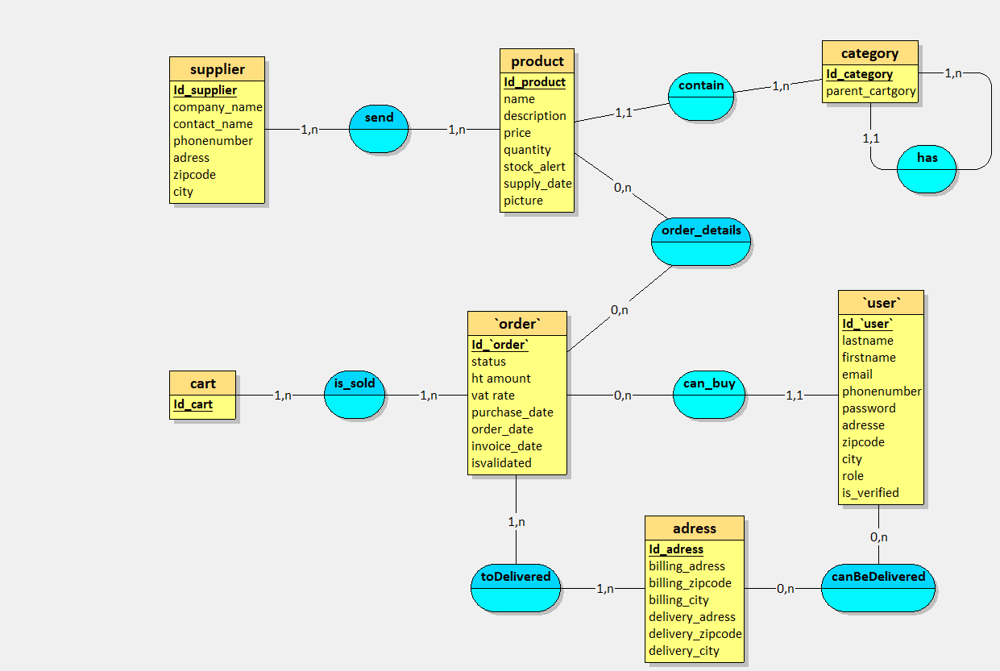
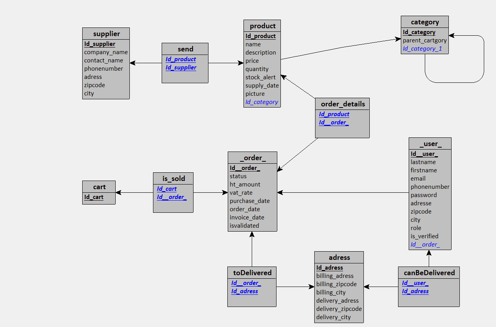
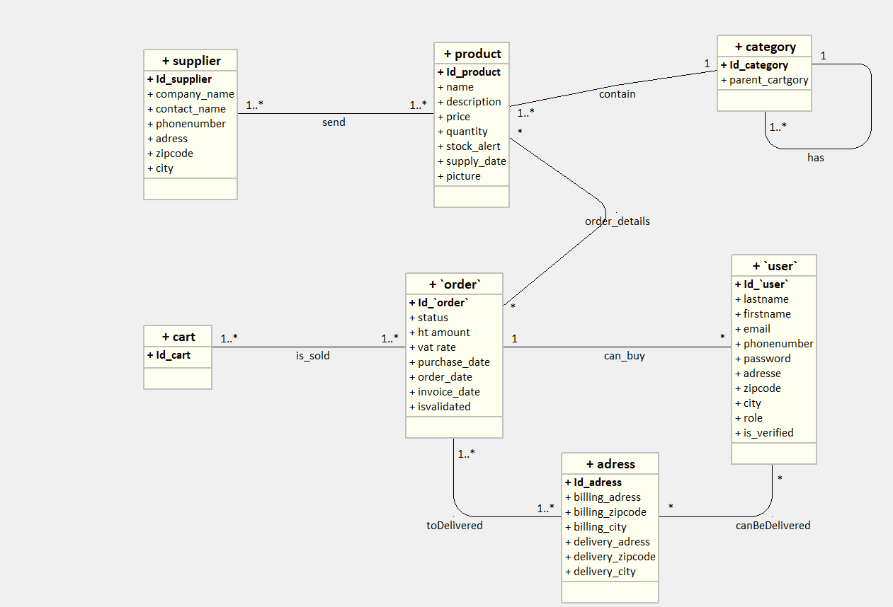

# **Base de données**

## [Dictionnaire de données](dataDictionnary.pdf "voir le dictionnaire de données en pdf")
[Voir le dictionnaire de données au format Excel](dataDictionnary.xlsx "voir le dictionnaire de données au format Excel")

## **Modèle conceptuel de données**


## **Modèle logique de données**

```sql
category = (Id_category INT AUTO_INCREMENT, parent_cartgory VARCHAR(20) , #Id_category_1);
cart = (Id_cart INT AUTO_INCREMENT);
_order_ = (Id__order_ INT AUTO_INCREMENT, status VARCHAR(20) , ht_amount DECIMAL(5,2)  , vat_rate DECIMAL(2,2)  , purchase_date DATE, order_date DATE, invoice_date DATE, isvalidated BOOLEAN);
supplier = (Id_supplier INT AUTO_INCREMENT, company_name VARCHAR(50) , contact_name VARCHAR(100) , phonenumber DECIMAL(14,0)  , adress VARCHAR(100) , zipcode VARCHAR(6) , city VARCHAR(50) );
adress = (Id_adress INT AUTO_INCREMENT, billing_adress VARCHAR(100) , billing_zipcode VARCHAR(6) , billing_city VARCHAR(50) , delivery_adress VARCHAR(100) , delivery_zipcode VARCHAR(6) , delivery_city VARCHAR(50) );
product = (Id_product INT AUTO_INCREMENT, name VARCHAR(30) , description VARCHAR(150) , price DECIMAL(5,2)  , quantity DECIMAL(3,0)  , stock_alert DECIMAL(2,0)  , supply_date DATE, picture VARCHAR(150) , #Id_category);
_user_ = (Id__user_ INT AUTO_INCREMENT, lastname VARCHAR(80) , firstname VARCHAR(80) , email VARCHAR(100) , phonenumber DECIMAL(14,0)  , password VARCHAR(64) , adresse VARCHAR(200) , zipcode VARCHAR(6) , city VARCHAR(50) , role VARCHAR(10) , is_verified BOOLEAN, #Id__order_);
send = (#Id_product, #Id_supplier);
is_sold = (#Id_cart, #Id__order_);
order_details = (#Id_product, #Id__order_);
canBeDelivered = (#Id__user_, #Id_adress);
toDelivered = (#Id__order_, #Id_adress);
```

## **Unified modeling language**


## **Structured Query Language**


```sql
CREATE TABLE category(
   Id_category INT AUTO_INCREMENT,
   parent_cartgory VARCHAR(20) ,
   Id_category_1 INT NOT NULL,
   PRIMARY KEY(Id_category),
   FOREIGN KEY(Id_category_1) REFERENCES category(Id_category)
);

CREATE TABLE cart(
   Id_cart INT AUTO_INCREMENT,
   PRIMARY KEY(Id_cart)
);

CREATE TABLE _order_(
   Id__order_ INT AUTO_INCREMENT,
   status VARCHAR(20) ,
   ht_amount DECIMAL(5,2)  ,
   vat_rate DECIMAL(2,2)  ,
   purchase_date DATE,
   order_date DATE,
   invoice_date DATE,
   isvalidated BOOLEAN,
   PRIMARY KEY(Id__order_)
);

CREATE TABLE supplier(
   Id_supplier INT AUTO_INCREMENT,
   company_name VARCHAR(50) ,
   contact_name VARCHAR(100) ,
   phonenumber DECIMAL(14,0)  ,
   adress VARCHAR(100) ,
   zipcode VARCHAR(6) ,
   city VARCHAR(50) ,
   PRIMARY KEY(Id_supplier)
);

CREATE TABLE adress(
   Id_adress INT AUTO_INCREMENT,
   billing_adress VARCHAR(100) ,
   billing_zipcode VARCHAR(6) ,
   billing_city VARCHAR(50) ,
   delivery_adress VARCHAR(100) ,
   delivery_zipcode VARCHAR(6) ,
   delivery_city VARCHAR(50) ,
   PRIMARY KEY(Id_adress)
);

CREATE TABLE product(
   Id_product INT AUTO_INCREMENT,
   name VARCHAR(30) ,
   description VARCHAR(150) ,
   price DECIMAL(5,2)  ,
   quantity DECIMAL(3,0)  ,
   stock_alert DECIMAL(2,0)  ,
   supply_date DATE,
   picture VARCHAR(150) ,
   Id_category INT NOT NULL,
   PRIMARY KEY(Id_product),
   FOREIGN KEY(Id_category) REFERENCES category(Id_category)
);

CREATE TABLE _user_(
   Id__user_ INT AUTO_INCREMENT,
   lastname VARCHAR(80) ,
   firstname VARCHAR(80) ,
   email VARCHAR(100) ,
   phonenumber DECIMAL(14,0)  ,
   password VARCHAR(64) ,
   adresse VARCHAR(200) ,
   zipcode VARCHAR(6) ,
   city VARCHAR(50) ,
   role VARCHAR(10) ,
   is_verified BOOLEAN,
   Id__order_ INT NOT NULL,
   PRIMARY KEY(Id__user_),
   FOREIGN KEY(Id__order_) REFERENCES _order_(Id__order_)
);

CREATE TABLE send(
   Id_product INT,
   Id_supplier INT,
   PRIMARY KEY(Id_product, Id_supplier),
   FOREIGN KEY(Id_product) REFERENCES product(Id_product),
   FOREIGN KEY(Id_supplier) REFERENCES supplier(Id_supplier)
);

CREATE TABLE is_sold(
   Id_cart INT,
   Id__order_ INT,
   PRIMARY KEY(Id_cart, Id__order_),
   FOREIGN KEY(Id_cart) REFERENCES cart(Id_cart),
   FOREIGN KEY(Id__order_) REFERENCES _order_(Id__order_)
);

CREATE TABLE order_details(
   Id_product INT,
   Id__order_ INT,
   PRIMARY KEY(Id_product, Id__order_),
   FOREIGN KEY(Id_product) REFERENCES product(Id_product),
   FOREIGN KEY(Id__order_) REFERENCES _order_(Id__order_)
);

CREATE TABLE canBeDelivered(
   Id__user_ INT,
   Id_adress INT,
   PRIMARY KEY(Id__user_, Id_adress),
   FOREIGN KEY(Id__user_) REFERENCES _user_(Id__user_),
   FOREIGN KEY(Id_adress) REFERENCES adress(Id_adress)
);

CREATE TABLE toDelivered(
   Id__order_ INT,
   Id_adress INT,
   PRIMARY KEY(Id__order_, Id_adress),
   FOREIGN KEY(Id__order_) REFERENCES _order_(Id__order_),
   FOREIGN KEY(Id_adress) REFERENCES adress(Id_adress)
);
```